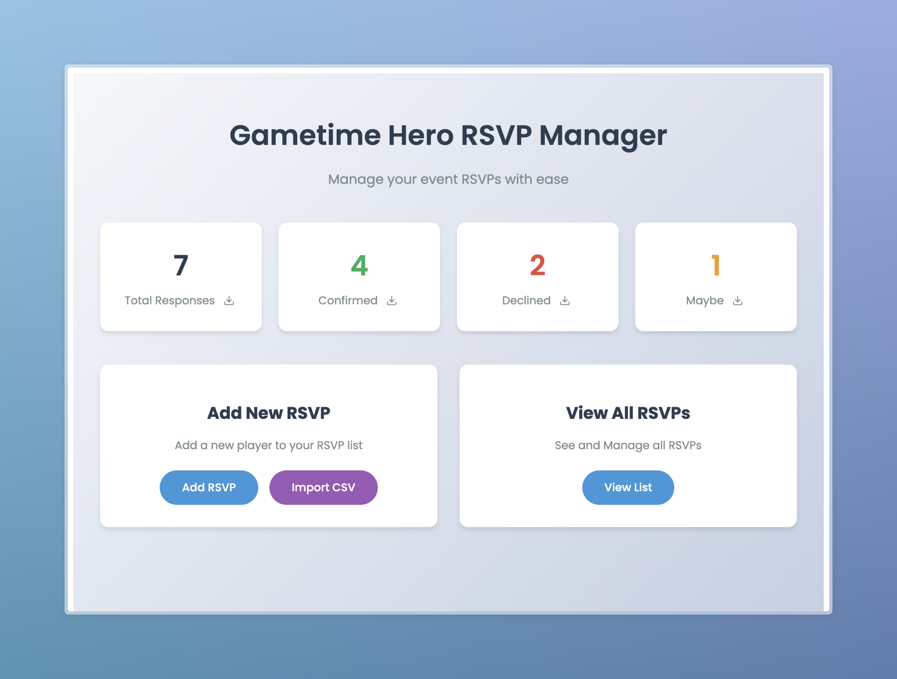
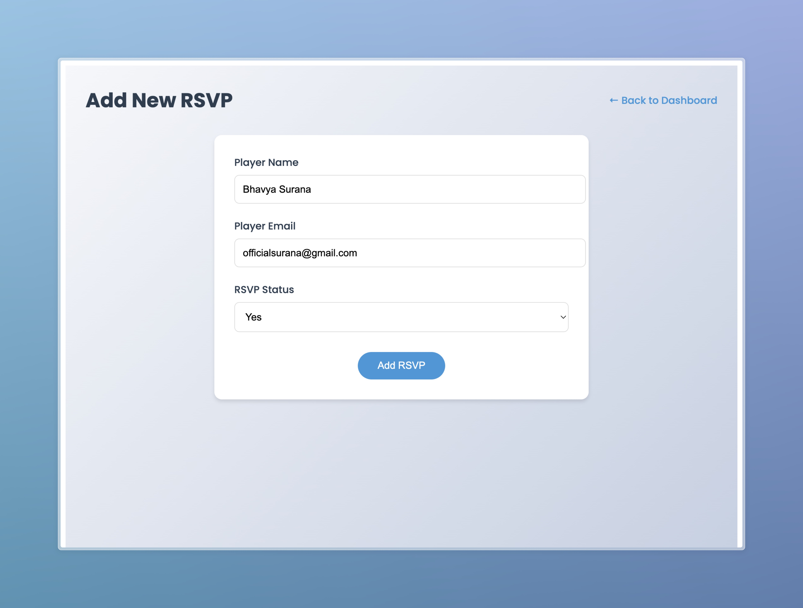
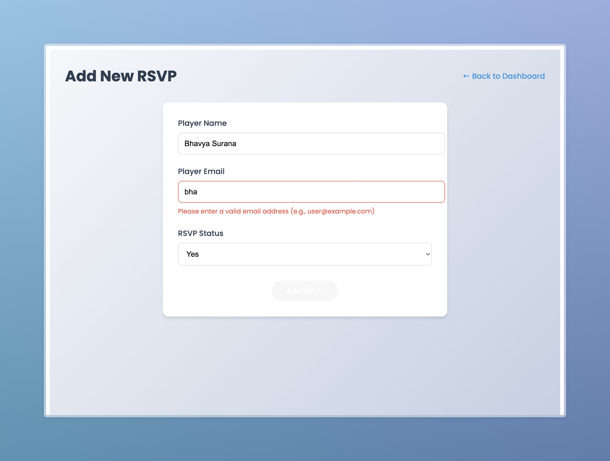
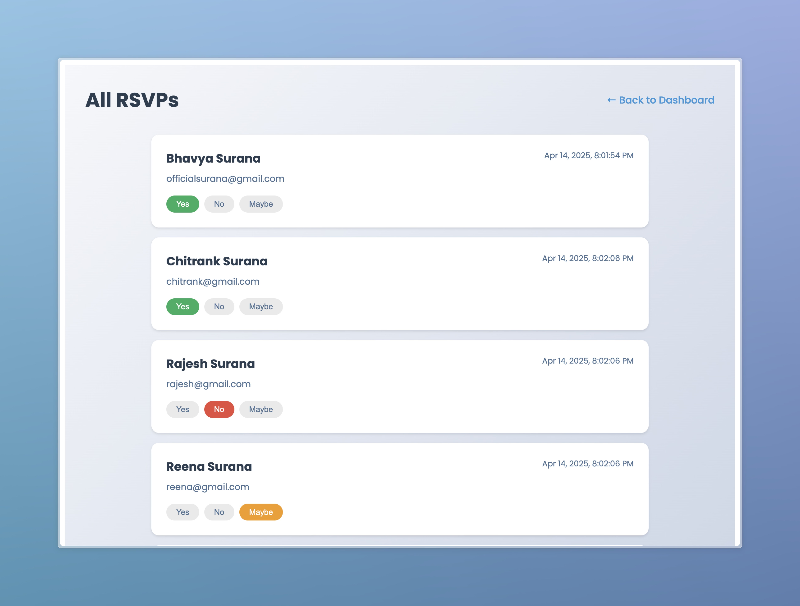

# Gametime Hero RSVP Manager

A modern and user-friendly RSVP management application built with Angular. This app helps you efficiently manage player responses for your gaming events.

## Key Features

- **Easy RSVP Management**
  - Add new RSVPs with player name, email, and response status
  - Update existing RSVPs with real-time status changes
  - View all RSVPs in a clean, organized list

- **Response Status Tracking**
  - Three response options: Yes, No, or Maybe
  - Visual status indicators for quick reference
  - Timestamp tracking for all RSVP updates

- **Data Management**
  - Import RSVPs in bulk using CSV files
  - Export RSVPs to CSV (filtered by status or all entries)
  - Automatic duplicate detection based on email addresses

- **User-Friendly Interface**
  - Modern, responsive design
  - Intuitive navigation
  - Form validation for accurate data entry
  - Real-time error feedback

## Development

### Prerequisites
- Node.js
- npm (Node Package Manager)
- Angular CLI (install globally using `npm install -g @angular/cli`)

### Installation

1. Clone the repository
2. Install dependencies:
```bash
npm install
```

### Running the Development Server

```bash
ng serve
```

Navigate to `http://localhost:4200/` in your browser to view the application.

## Usage

1. **Adding a New RSVP**
   - Click "Add RSVP" on the dashboard
   - Fill in the player's name and email
   - Select their response status
   - Submit the form

2. **Managing RSVPs**
   - View all RSVPs in the list view
   - Update response status with a single click
   - Track when responses were last updated

3. **Import/Export**
   - Import multiple RSVPs using a CSV file (Acceptable CSV Columns: Name, Email, Status)
   - Export RSVPs to CSV for external use
   - Filter exports by response status


## Screenshots
```markdown




```


## Contributing

Contributions are welcome! Please feel free to submit a Pull Request.